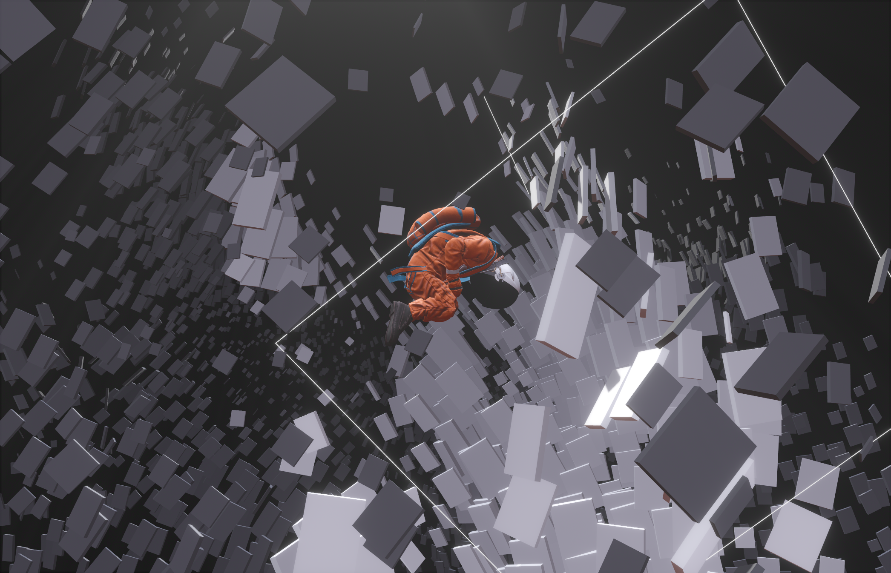

"Drift" is an immersive interactive website showcasing real-time particle simulations powered by GPGPU with AI-generated storytelling. 

Set in the vastness of space, the project follows an astronaut who has lost his way and is drifting further from Earth with each passing day. Through daily AI-generated diary entries, visitors explore the astronaut's emotional journey—his battle with isolation, his reflections on the life left behind, and the fading hope of reuniting with his loved ones. The interactive elements allow users to engage with the particle simulations, creating a deep connection to the astronaut's experiences as they navigate the infinite void.

[**Live Demo**](https://momentchan.github.io/drift/).
